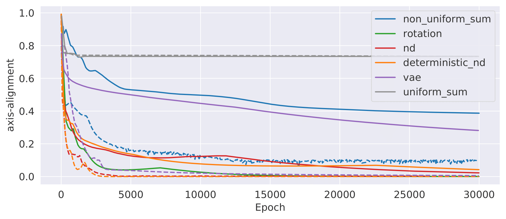
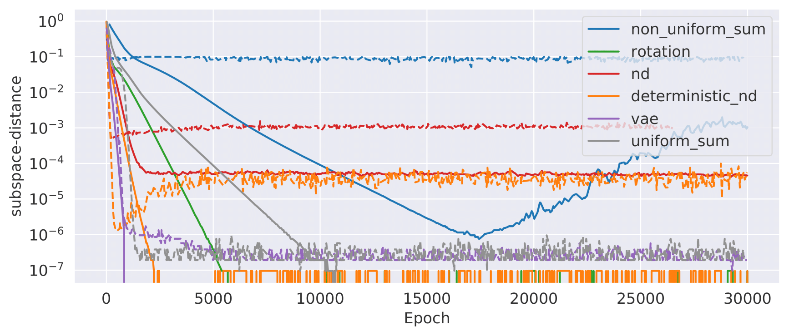
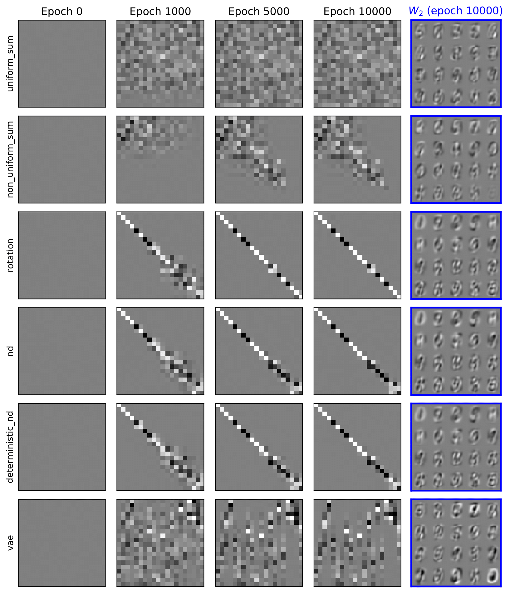
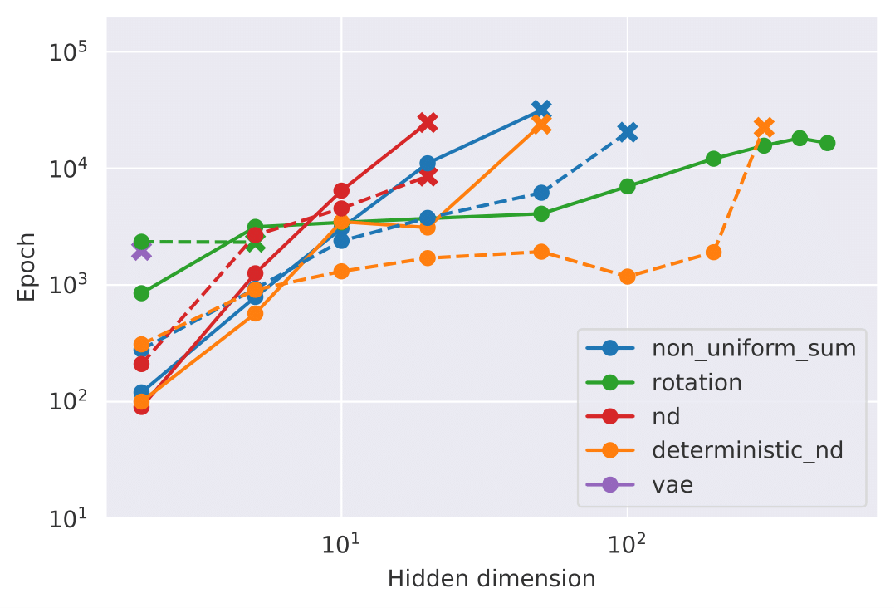

# Regularized linear autoencoders recover the principal components, eventually

This repository is the official implementation of "Regularized linear autoencoders recover the principal components, eventually". 

## Requirements
Create a new conda environment:
```conda
conda create -n linear-autoencoders python=3.7
source activate linear-autoencoders
```

Install requirements:
```setup
pip install -r requirements.txt
```

## Training

We recommend using [Weights & Biases](https://www.wandb.com/) (`wandb`) for training and keeping track of results.

In `sweeps/sweep.sh`,
- Set `PYTHONPATH` to be the root path of this repository.
- Find your `wandb` API key in [settings](https://app.wandb.ai/settings), and paste it after `wandb login`.
- Enter your `wandb` username. You can find your username in the "profile" page under your name.

### 1. MNIST experiment (Figure 2 & 3)
First, create a [wandb sweep](https://docs.wandb.com/sweeps) with the following command
```sweep_mnist
wandb sweep sweeps/mnist.yaml
```
This should generate a sweep ID. Copy it and paste in `sweeps/sweep.sh`. You can now run the sweep agents.
```run_sweep_mnist
bash sweeps/sweep.sh
``` 
You can run multiple of the above command in parallel. Check your results [here](https://app.wandb.ai/).

### 2. Synthetic dataset experiment (Figure 4)
Similar to the MNIST experiment, first create a wandb sweep.
```sweep_synth
wandb sweep sweeps/synth.yaml
```
This should generate a sweep ID. Copy it and paste in `sweeps/sweep.sh`. You can now run the sweep agents.
```run_sweep_mnist
bash sweeps/sweep.sh
``` 
You can run multiple of the above command in parallel. Check your results [here](https://app.wandb.ai/).


## Results
Experiment data can be retrieved through the [wandb API](https://docs.wandb.com/library/api). 
The following plots in the paper are generated from the experiment data.
 
### 1. MNIST experiment
Figure 2(a)


Figure 2(b)


Figure 3


### 2. Synthetic dataset experiment
Figure 4

